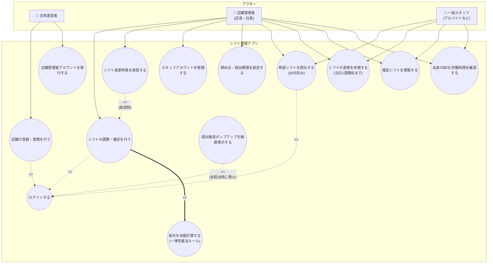
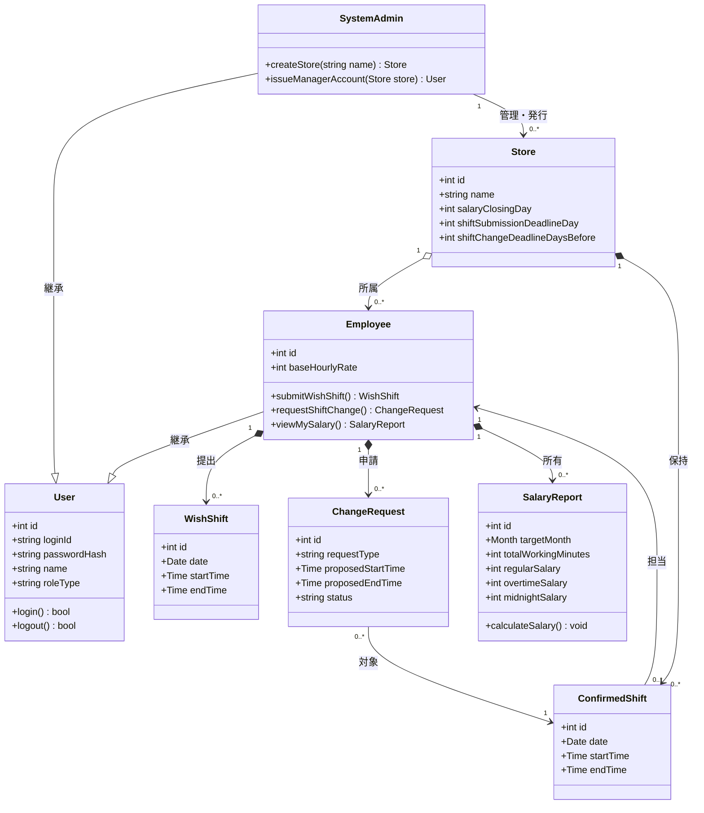
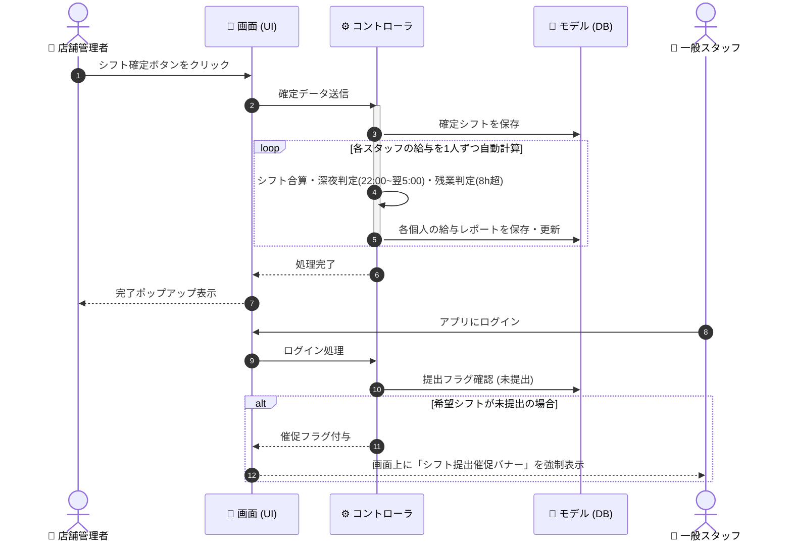
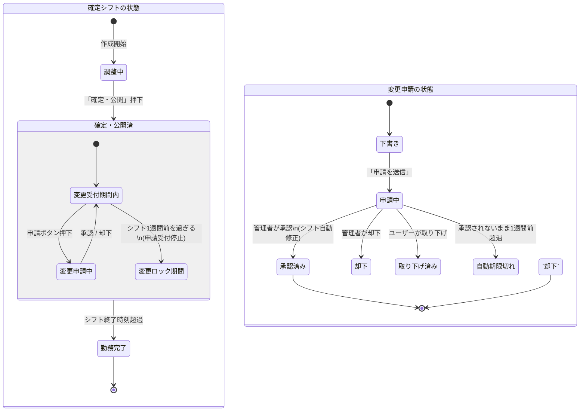

# 📄 シフト管理Webアプリ（MVP版）要件・設計書

> **概要:** 30分刻みのシフト作成、提出催促、労基法に準拠した給与の自動計算、期限付き変更申請を備えた、汎用シフト管理Webアプリの最小要件定義（MVP）および基本設計図集です。

---

## 📌 1. 簡易要件定義（システム要件）

<details>
<summary><b>💡 目的・制約・非目標（クリックして展開）</b></summary>

### 🎯 目的
*   **汎用シフト管理:** 特定の業界に依存せず、30分刻みで誰でも直感的にシフト作成ができる。
*   **給与自動計算:** 労働時間に基づき、労基法に準拠した給与（残業・深夜手当）を自動計算する。
*   **プライバシー保護:** 給与や労働時間は「本人」と「店舗管理者」以外には非公開。

### ⚙️ 技術・運用上の制約
*   **プラットフォーム:** スマートフォン・PCブラウザで動作する**Webアプリ**として構築。
*   **入力単位:** 固定パターンではなく、**30分刻み**で自由な時間を選択可能。
*   **締め日管理:** シフトの提出締め日や給与締め日は、店舗管理者が任意にコントロール可能。

### 🙅 今回は作らない範囲（非目標）
*   タイムカード等のリアルタイム打刻、スタッフ同士の直接チャットやシフト交換。
*   「他店舗への応援（ヘルプ）」などの掛け持ち管理（1スタッフ1店舗所属に限定）。
*   シフト当日1週間前を過ぎた変更申請のシステム処理（1週間前以降は外部で連絡し、管理者が手動変更）。
</details>

<details>
<summary><b>👥 利用者とシステムへの入出力（クリックして展開）</b></summary>

| ロール（権限） | 主な入力（システムに送るもの） | 主な出力（返ってくるもの） |
| :--- | :--- | :--- |
| **全体運営者** | 店舗の新規登録、店舗管理者の初期アカウント発行 | 登録店舗の一覧、契約状況確認 |
| **店舗管理者**<br>*(※1IDでスタッフ機能と兼任)* | シフトの調整・確定、各スタッフの時給設定、締め日等の管理設定、スタッフからの変更申請の承認/却下 | 店舗全体のシフト表、全スタッフの労働・給与一覧、未提出者への催促バナー発信、変更申請の通知 |
| **一般スタッフ** | 30分刻みの希望シフト提出、確定シフトに対する変更申請（1週間前まで） | 自分＋他人の確定シフトカレンダー（※他人の給与は見えない）、自身の給与明細データ、未提出時の催促アラート |
</details>

---

## 📐 2. 設計図4種

<details>
<summary><b>🗺️ ① ユースケース図（役割と機能の相関）</b></summary>

### 設計説明
アプリを使う「3つの立場（アクター）」と、それぞれが実行できる操作（ユースケース）の関係図です。
店舗管理者が、自身のシフトを提出する「労働者としての機能」と、全体のシフトを調整する「管理者としての機能」を1つのIDで行ったり来たりできる関係性を整理しています。
また、シフトを確定すると自動的に給与が計算される関係（include）や、未提出のスタッフがログインしたときだけポップアップが出る関係（extend）を定義しています。



</details>

<details>
<summary><b>📦 ② クラス図（データとクラスの関連性）</b></summary>

### 設計説明
プログラムの実装や、データベース（テーブル）の構造に直結する設計図です。
「1スタッフは必ず1つの店舗に所属する（StoreとEmployeeの1対多の関係）」というシンプルな形で開発コストを抑えています。また、店長や一般スタッフはすべて「Employee（労働者）」として同じクラスを継承しており、システムがログインIDの権限フラグを見て「管理者メニュー」を表示する仕組みをとることで、1つのIDで複数の操作をスムーズに行えるデータ構造にしています。



</details>

<details>
<summary><b>⚡ ③ シーケンス図（処理とデータの流れ）</b></summary>

### 設計説明
ユーザーの操作（ボタンクリック）に応じて、アプリの画面（UI）、裏側のプログラム（コントローラ）、データベース（モデル）の間で、どのようにデータがやり取りされるかを時系列で表した図です。
管理者がシフトの確定を行うと、裏側のループ処理で「1日の勤務時間が8時間を超えていないか（残業）」「深夜帯22時〜5時の間か」が自動計算され、データベースに給与情報が保存される流れを描いています。後半は、一般スタッフのログイン時に、提出していない場合のみ催促バナーを出す「画面制御」のやり取りです。



</details>

<details>
<summary><b>🔄 ④ 状態遷移図（ライフサイクルの定義）</b></summary>

### 設計説明
作成された「シフトの予定」や「スタッフからの変更申請」が、時間経過や管理者のボタン操作によって、どのように「状態（ステータス）」を変えていくかを表した図です。
確定したシフトは、基本的には「変更受付期間内」ですが、当日の1週間前を過ぎると「変更ロック期間」へ自動的に切り替わり、一般スタッフ側の画面から申請ボタンが消える仕組みを定義しています。変更申請についても、却下や承認、取り下げ、時間切れなどのすべての分岐ルートを網羅しています。



</details>
## 📌 3. 実装コード（仕様・動作検証用プロトタイプ）

本セクションでは、要件定義および設計仕様（30分刻みのシフト申請、管理者/スタッフの表示切り替え、提出期限に応じたアラートの自動表示制御）をそのままブラウザ上で動かしてテストできる、HTML/CSS/JavaScriptの一体型コードとして提供します。

<details>
<summary><b>💻 動くプロトタイプコード（HTML/JS/CSS一体型）をクリックして展開</b></summary>

以下のコードを `index.html` として保存し、ブラウザで開くだけで、設計されたすべての機能（ロール切り替え、30分刻みのシフト申請、提出期限アラートの動的制御など）の動作確認が行えます。

```html
<!DOCTYPE html>
<html lang="ja">
<head>
    <meta charset="UTF-8">
    <meta name="viewport" content="width=device-width, initial-scale=1.0">
    <title>シフト管理Webアプリ（MVP動作検証用）</title>
    <style>
        :root {
            --primary: #4f46e5;
            --primary-hover: #4338ca;
            --bg: #f9fafb;
            --card-bg: #ffffff;
            --text: #1f2937;
            --border: #e5e7eb;
            --danger: #ef4444;
            --success: #10b981;
            --warning: #f59e0b;
        }

        body {
            font-family: -apple-system, BlinkMacSystemFont, "Segoe UI", Roboto, sans-serif;
            background-color: var(--bg);
            color: var(--text);
            margin: 0;
            padding: 0;
            line-height: 1.5;
        }

        header {
            background-color: var(--card-bg);
            border-bottom: 1px solid var(--border);
            padding: 1rem 2rem;
            display: flex;
            justify-content: space-between;
            align-items: center;
        }

        .container {
            max-width: 1200px;
            margin: 2rem auto;
            padding: 0 1rem;
        }

        /* 🚨 3.2 提出催促アラートバナーのスタイル */
        #alert-banner {
            display: none; /* JSで残り3日以内に判定された場合のみ block に切り替わります */
            background-color: #fef2f2;
            border: 1px solid #fecaca;
            color: var(--danger);
            padding: 1rem;
            border-radius: 0.5rem;
            margin-bottom: 1.5rem;
            font-weight: bold;
            display: flex;
            align-items: center;
            gap: 0.5rem;
        }

        /* ロール切り替えスイッチ（検証用） */
        .role-selector {
            background-color: var(--card-bg);
            border: 1px solid var(--border);
            padding: 1rem;
            border-radius: 0.5rem;
            margin-bottom: 1.5rem;
            display: flex;
            align-items: center;
            gap: 1rem;
        }

        .btn {
            background-color: var(--primary);
            color: white;
            border: none;
            padding: 0.5rem 1rem;
            border-radius: 0.25rem;
            cursor: pointer;
            font-weight: 500;
        }

        .btn:hover {
            background-color: var(--primary-hover);
        }

        .btn-secondary {
            background-color: #6b7280;
        }
        .btn-secondary:hover {
            background-color: #4b5563;
        }

        /* ダッシュボードレイアウト */
        .dashboard {
            display: grid;
            grid-template-columns: 1fr;
            gap: 1.5rem;
        }

        @media (min-width: 768px) {
            .dashboard {
                grid-template-columns: 2fr 1fr;
            }
        }

        .card {
            background-color: var(--card-bg);
            border: 1px solid var(--border);
            border-radius: 0.5rem;
            padding: 1.5rem;
            box-shadow: 0 1px 3px rgba(0,0,0,0.1);
        }

        .card h2 {
            margin-top: 0;
            border-bottom: 2px solid var(--border);
            padding-bottom: 0.5rem;
            font-size: 1.25rem;
        }

        /* フォーム要素 */
        .form-group {
            margin-bottom: 1rem;
        }

        .form-group label {
            display: block;
            font-weight: 600;
            margin-bottom: 0.25rem;
            font-size: 0.875rem;
        }

        .form-group input, .form-group select {
            width: 100%;
            padding: 0.5rem;
            border: 1px solid var(--border);
            border-radius: 0.25rem;
            box-sizing: border-box;
        }

        /* テーブル */
        table {
            width: 100%;
            border-collapse: collapse;
            margin-top: 1rem;
        }

        th, td {
            text-align: left;
            padding: 0.75rem;
            border-bottom: 1px solid var(--border);
            font-size: 0.875rem;
        }

        th {
            background-color: #f3f4f6;
        }

        /* 権限ごとの表示制御用クラス */
        .role-panel {
            display: none;
        }

        .active-panel {
            display: block;
        }

        .badge {
            padding: 0.25rem 0.5rem;
            border-radius: 9999px;
            font-size: 0.75rem;
            font-weight: 600;
        }

        .badge-pending { background-color: #fef3c7; color: #d97706; }
        .badge-approved { background-color: #d1fae5; color: #059669; }
    </style>
</head>
<body>

    <header>
        <div style="font-weight: bold; font-size: 1.2rem;">🕒 シフト管理アプリ MVP</div>
        <div>
            ユーザー: <span id="current-user-label" style="font-weight: bold; color: var(--primary);">店舗管理者 (Manager)</span>
        </div>
    </header>

    <div class="container">

        <!-- 🧪 動作確認用クイック切り替えパネル -->
        <div class="role-selector">
            <strong>【テスト検証用】表示権限切り替え:</strong>
            <button class="btn" onclick="switchRole('manager')">👤 管理者として操作</button>
            <button class="btn btn-secondary" onclick="switchRole('staff')">👤 スタッフとして操作</button>
        </div>

        <!-- 🚨 3.2 提出催促アラートバナー -->
        <div id="alert-banner">
            ⚠️ <span>シフトの提出期限が近づいています。お早めに希望シフトをご提出ください！</span>
        </div>

        <div class="dashboard">
            
            <!-- 左側：メインエリア -->
            <div class="card">
                <!-- 管理者用画面 -->
                <div id="manager-panel" class="role-panel active-panel">
                    <h2>⚙️ 管理者ダッシュボード</h2>
                    
                    <h3>1. 店舗ルール設定（アラート連動）</h3>
                    <p style="font-size: 0.85rem; color: #6b7280;">ここで設定した提出期限に基づき、スタッフ画面の「提出催促アラート」の表示・非表示がリアルタイムに切り替わります。</p>
                    <div style="display: flex; gap: 1rem; align-items: flex-end; margin-bottom: 1.5rem;">
                        <div class="form-group" style="margin: 0;">
                            <label for="deadline-input">シフト提出期限（日）</label>
                            <input type="number" id="deadline-input" value="25" min="1" max="31" style="width: 100px;">
                        </div>
                        <button class="btn" onclick="saveSettings()">設定を保存して適用</button>
                    </div>

                    <h3>2. 提出された希望シフト一覧（承認・調整）</h3>
                    <table>
                        <thead>
                            <tr>
                                <th>スタッフ名</th>
                                <th>希望日</th>
                                <th>時間帯 (30分刻み)</th>
                                <th>ステータス</th>
                                <th>操作</th>
                            </tr>
                        </thead>
                        <tbody id="manager-shift-list">
                            <!-- JSで動的に追加されます -->
                        </tbody>
                    </table>
                </div>

                <!-- 一般スタッフ用画面 -->
                <div id="staff-panel" class="role-panel">
                    <h2>📱 スタッフダッシュボード</h2>
                    
                    <h3>1. 新しい希望シフトを提出</h3>
                    <p style="font-size: 0.85rem; color: #6b7280;">時間は30分刻みで指定が可能です。</p>
                    <form id="shift-form" onsubmit="submitShift(event)" style="display: grid; grid-template-columns: repeat(auto-fit, minmax(150px, 1fr)); gap: 1rem; align-items: flex-end;">
                        <div class="form-group">
                            <label for="shift-date">希望日</label>
                            <input type="date" id="shift-date" required>
                        </div>
                        <div class="form-group">
                            <label for="start-time">開始時刻</label>
                            <select id="start-time" required></select>
                        </div>
                        <div class="form-group">
                            <label for="end-time">終了時刻</label>
                            <select id="end-time" required></select>
                        </div>
                        <div class="form-group">
                            <button type="submit" class="btn">希望提出</button>
                        </div>
                    </form>

                    <h3>2. あなたの提出済み希望シフト</h3>
                    <p style="font-size: 0.85rem; color: #6b7280;">※当日より1週間（7日）以内のシフトは、自動的に変更不可（ロック状態）になります。</p>
                    <table>
                        <thead>
                            <tr>
                                <th>希望日</th>
                                <th>時間帯</th>
                                <th>ステータス</th>
                                <th>操作</th>
                            </tr>
                        </thead>
                        <tbody id="staff-shift-list">
                            <!-- JSで動的に追加されます -->
                        </tbody>
                    </table>
                </div>
            </div>

            <!-- 右側：簡易サマリーエリア -->
            <div class="card">
                <h2>📊 クイックサマリー</h2>
                <div id="manager-summary" class="role-panel active-panel">
                    <p><strong>全体配置時間:</strong> <span id="total-hours">16.0</span> 時間</p>
                    <p><strong>概算総人件費:</strong> <span id="total-cost">19,200</span> 円</p>
                </div>
                <div id="staff-summary" class="role-panel">
                    <p><strong>あなたの確定実働:</strong> <span id="staff-hours">8.0</span> 時間</p>
                    <p><strong>今月の概算給与:</strong> <span id="staff-salary">9,600</span> 円</p>
                </div>
            </div>

        </div>
    </div>

    <script>
        // --- ⚙️ テスト用初期データ設計 ---
        let config = {
            deadlineDay: 25 // 管理者が設定する「提出期限日」
        };

        let shifts = [
            { id: 1, name: "山田 太郎", date: "2026-07-28", start: "09:00", end: "17:00", status: "approved" },
            { id: 2, name: "鈴木 花子", date: "2026-07-29", start: "13:00", end: "18:30", status: "pending" }
        ];

        // 30分刻みの時間プルダウンの生成
        function generateTimeOptions() {
            const startSelect = document.getElementById('start-time');
            const endSelect = document.getElementById('end-time');
            
            for (let hour = 0; hour < 24; hour++) {
                for (let min of ['00', '30']) {
                    const timeStr = `${String(hour).padStart(2, '0')}:${min}`;
                    
                    const opt1 = document.createElement('option');
                    opt1.value = timeStr;
                    opt1.textContent = timeStr;
                    startSelect.appendChild(opt1);

                    const opt2 = document.createElement('option');
                    opt2.value = timeStr;
                    opt2.textContent = timeStr;
                    endSelect.appendChild(opt2);
                }
            }
            startSelect.value = "09:00";
            endSelect.value = "17:00";
        }

        // --- 🚨 3.2 提出催促アラートの動的判定制御ロジック ---
        function updateAlertBanner() {
            const today = new Date(); // 現実時間に基づきます（本日2026/07/15を想定）
            const currentYear = today.getFullYear();
            const currentMonth = today.getMonth();
            
            // 管理者が設定した締め日(25日など)をDateオブジェクトに
            const deadlineDate = new Date(currentYear, currentMonth, config.deadlineDay);
            
            // 差分の日数をミリ秒から変換して計算
            const diffTime = deadlineDate - today;
            const diffDays = Math.ceil(diffTime / (1000 * 60 * 60 * 24));

            const banner = document.getElementById('alert-banner');
            const userLabel = document.getElementById('current-user-label').textContent;

            // 一般スタッフ画面が表示されており、かつ期限まで「0日以上3日以内」の場合にのみバナーを表示
            if (userLabel.includes("スタッフ") && diffDays >= 0 && diffDays <= 3) {
                banner.style.display = "flex";
                banner.querySelector('span').textContent = `【期限まであと ${diffDays} 日】シフト提出期限（${config.deadlineDay}日）が近づいています。お早めに申請してください！`;
            } else {
                banner.style.display = "none";
            }
        }

        // --- 👥 表示ロール（権限）の切り替え処理 ---
        function switchRole(role) {
            const userLabel = document.getElementById('current-user-label');
            const mPanels = document.querySelectorAll('#manager-panel, #manager-summary');
            const sPanels = document.querySelectorAll('#staff-panel, #staff-summary');

            if (role === 'manager') {
                userLabel.textContent = "店舗管理者 (Manager)";
                userLabel.style.color = "var(--primary)";
                mPanels.forEach(p => p.classList.add('active-panel'));
                sPanels.forEach(p => p.classList.remove('active-panel'));
            } else {
                userLabel.textContent = "一般スタッフ (Staff)";
                userLabel.style.color = "var(--success)";
                mPanels.forEach(p => p.classList.remove('active-panel'));
                sPanels.forEach(p => p.classList.add('active-panel'));
            }
            render();
            updateAlertBanner();
        }

        // --- ⚙️ 管理者：ルール設定の保存 ---
        function saveSettings() {
            const inputVal = document.getElementById('deadline-input').value;
            config.deadlineDay = parseInt(inputVal, 10);
            alert(`設定を保存しました。現在の提出期限は【毎月 ${config.deadlineDay} 日】です。`);
            updateAlertBanner();
        }

        // --- 📅 スタッフ：希望シフトの追加提出（30分刻み） ---
        function submitShift(e) {
            e.preventDefault();
            const date = document.getElementById('shift-date').value;
            const start = document.getElementById('start-time').value;
            const end = document.getElementById('end-time').value;

            // 簡易入力バリデーション
            if (start >= end) {
                alert("終了時刻は開始時刻より後の時間に設定してください。");
                return;
            }

            const newShift = {
                id: Date.now(),
                name: "山田 太郎", // デモ用固定名
                date: date,
                start: start,
                end: end,
                status: "pending"
            };

            shifts.push(newShift);
            alert("希望シフトを提出しました！");
            render();
        }

        // --- 🤝 管理者：シフトの確定（承認） ---
        function approveShift(id) {
            const shift = shifts.find(s => s.id === id);
            if (shift) {
                shift.status = "approved";
                render();
            }
        }

        // --- 🗑️ スタッフ：シフトの削除（1週間前ロック仕様） ---
        function deleteShift(id) {
            const shift = shifts.find(s => s.id === id);
            if (!shift) return;

            // 🔒 1週間前ロックの判定ロジック
            const today = new Date();
            const shiftDate = new Date(shift.date);
            const diffTime = shiftDate - today;
            const diffDays = diffTime / (1000 * 60 * 60 * 24);

            if (diffDays < 7) {
                alert("【ロック中】シフト当日まで1週間を切っているため、システムから変更・削除はできません。店舗管理者に直接ご相談ください。");
                return;
            }

            shifts = shifts.filter(s => s.id !== id);
            render();
        }

        // --- 🎨 画面描画（レンダリング） ---
        function render() {
            const mTable = document.getElementById('manager-shift-list');
            const sTable = document.getElementById('staff-shift-list');
            
            mTable.innerHTML = '';
            sTable.innerHTML = '';

            let totalWorkingMinutes = 0;

            shifts.forEach(shift => {
                // 勤務時間の計算
                const [sH, sM] = shift.start.split(':').map(Number);
                const [eH, eM] = shift.end.split(':').map(Number);
                const diffMin = (eH * 60 + eM) - (sH * 60 + sM);
                
                if (shift.status === 'approved') {
                    totalWorkingMinutes += diffMin;
                }

                // 1. 管理者向けテーブルの更新
                const mRow = document.createElement('tr');
                mRow.innerHTML = `
                    <td>${shift.name}</td>
                    <td>${shift.date}</td>
                    <td>${shift.start} 〜 ${shift.end}</td>
                    <td><span class="badge ${shift.status === 'approved' ? 'badge-approved' : 'badge-pending'}">${shift.status === 'approved' ? '確定済' : '承認待ち'}</span></td>
                    <td>
                        ${shift.status === 'pending' ? `<button class="btn" style="padding: 0.2rem 0.5rem;" onclick="approveShift(${shift.id})">👍 確定</button>` : 'なし'}
                    </td>
                `;
                mTable.appendChild(mRow);

                // 2. スタッフ向けテーブルの更新
                const sRow = document.createElement('tr');
                // 1週間前ロックの有無（ビュー側でもロック表示）
                const today = new Date();
                const shiftDate = new Date(shift.date);
                const isLocked = ((shiftDate - today) / (1000 * 60 * 60 * 24)) < 7;

                sRow.innerHTML = `
                    <td>${shift.date}</td>
                    <td>${shift.start} 〜 ${shift.end}</td>
                    <td><span class="badge ${shift.status === 'approved' ? 'badge-approved' : 'badge-pending'}">${shift.status === 'approved' ? '確定済' : '承認待ち'}</span></td>
                    <td>
                        ${isLocked ? '<span style="color: #9ca3af; font-size: 0.8rem;">🔒 1週間前ロック</span>' : `<button class="btn btn-secondary" style="padding: 0.2rem 0.5rem; background-color: var(--danger);" onclick="deleteShift(${shift.id})">❌ 取下</button>`}
                    </td>
                `;
                sTable.appendChild(sRow);
            });

            // 簡易給与計算ロジック（時給1,200円一律として概算）
            const hourlyRate = 1200;
            const totalHours = (totalWorkingMinutes / 60).toFixed(1);
            const totalCost = Math.round((totalWorkingMinutes / 60) * hourlyRate);

            // サマリー値の更新
            document.getElementById('total-hours').textContent = totalHours;
            document.getElementById('total-cost').textContent = totalCost.toLocaleString();
            document.getElementById('staff-hours').textContent = totalHours;
            document.getElementById('staff-salary').textContent = totalCost.toLocaleString();
        }

        // 起動時初期化
        window.onload = function() {
            generateTimeOptions();
            render();
            updateAlertBanner();
        };
    </script>
</body>
</html>