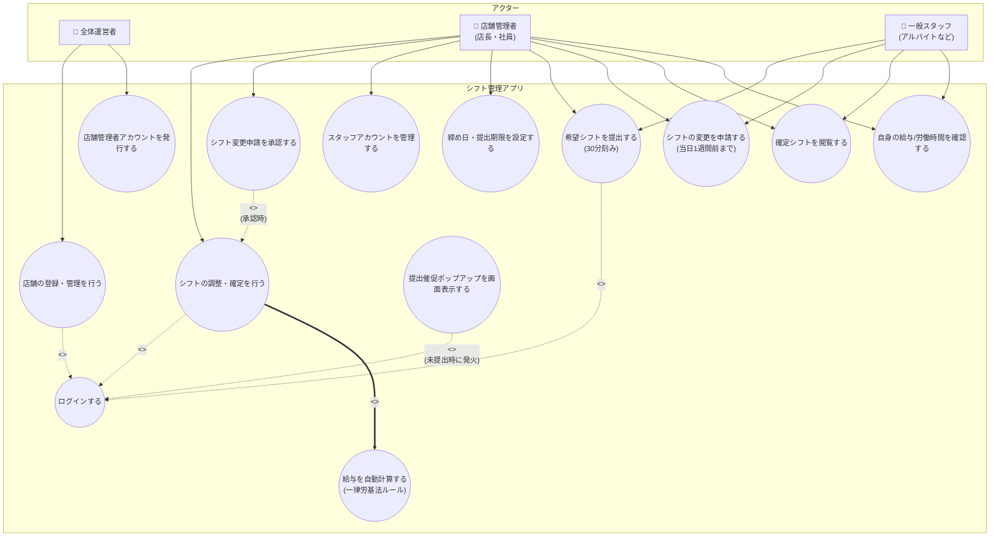
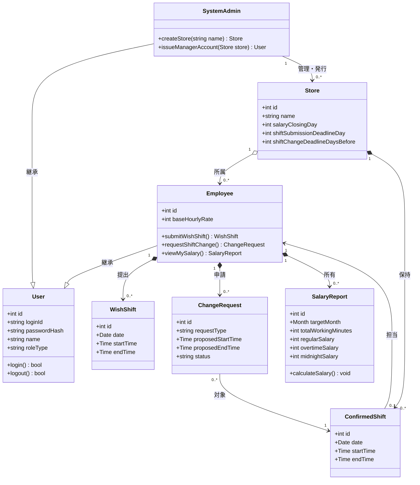
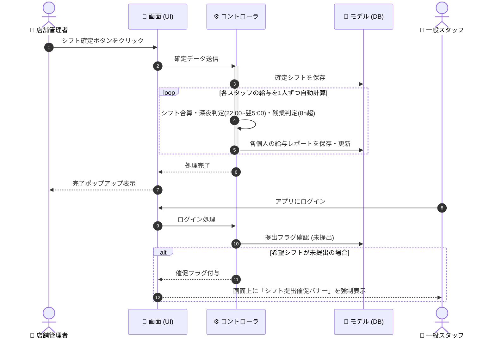
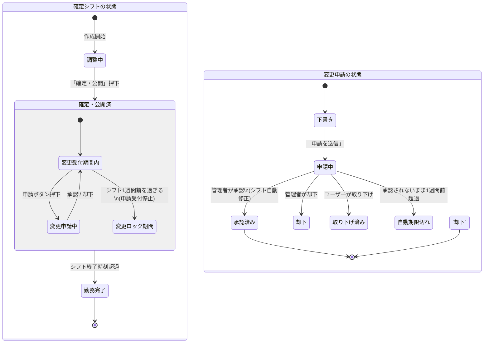

# 📄 シフト管理Webアプリ（MVP版）要件・設計書

> **概要:** 30分刻みのシフト作成、提出催促、労基法に準拠した給与の自動計算、期限付き変更申請を備えた、汎用シフト管理Webアプリの最小要件定義（MVP）および基本設計図集です。

---

## 📌 1. 簡易要件定義（システム要件）

<details>
<summary><b>💡 目的・制約・非目標（クリックして展開）</b></summary>

### 🎯 目的
*   **汎用シフト管理:** 特定の業界に依存せず、30分刻みで誰でも直感的にシフト作成ができる。
*   **給与自動計算:** 労働時間に基づき、労基法に準拠した給与（残業・深夜手当）を自動計算する。
*   **プライバシー保護:** 給与や労働時間は「本人」と「店舗管理者」以外には非公開。

### ⚙️ 技術・運用上の制約
*   **プラットフォーム:** スマートフォン・PCブラウザで動作する**Webアプリ**として構築。
*   **入力単位:** 固定パターンではなく、**30分刻み**で自由な時間を選択可能。
*   **締め日管理:** シフトの提出締め日や給与締め日は、店舗管理者が任意にコントロール可能。

### 🙅 今回は作らない範囲（非目標）
*   タイムカード等のリアルタイム打刻、スタッフ同士の直接チャットやシフト交換。
*   「他店舗への応援（ヘルプ）」などの掛け持ち管理（1スタッフ1店舗所属に限定）。
*   シフト当日1週間前を過ぎた変更申請のシステム処理（1週間前以降は外部で連絡し、管理者が手動変更）。
</details>

<details>
<summary><b>👥 利用者とシステムへの入出力（クリックして展開）</b></summary>

| ロール（権限） | 主な入力（システムに送るもの） | 主な出力（返ってくるもの） |
| :--- | :--- | :--- |
| **全体運営者** | 店舗の新規登録、店舗管理者の初期アカウント発行 | 登録店舗の一覧、契約状況確認 |
| **店舗管理者**<br>*(※1IDでスタッフ機能と兼任)* | シフトの調整・確定、各スタッフの時給設定、締め日等の管理設定、スタッフからの変更申請の承認/却下 | 店舗全体のシフト表、全スタッフの労働・給与一覧、未提出者への催促バナー発信、変更申請の通知 |
| **一般スタッフ** | 30分刻みの希望シフト提出、確定シフトに対する変更申請（1週間前まで） | 自分＋他人の確定シフトカレンダー（※他人の給与は見えない）、自身の給与明細データ、未提出時の催促アラート |
</details>

---

## 📐 2. 設計図4種

<details>
<summary><b>🗺️ ① ユースケース図（役割と機能の相関）</b></summary>

### 設計説明
アプリを使う「3つの立場（アクター）」と、それぞれが実行できる操作（ユースケース）の関係図です。
店舗管理者が、自身のシフトを提出する「労働者としての機能」と、全体のシフトを調整する「管理者としての機能」を1つのIDで行ったり来たりできる関係性を整理しています。
また、シフトを確定すると自動的に給与が計算される関係（include）や、未提出のスタッフがログインしたときだけポップアップが出る関係（extend）を定義しています。



</details>

<details>
<summary><b>📦 ② クラス図（データとクラスの関連性）</b></summary>

### 設計説明
プログラムの実装や、データベース（テーブル）の構造に直結する設計図です。
「1スタッフは必ず1つの店舗に所属する（StoreとEmployeeの1対多の関係）」というシンプルな形で開発コストを抑えています。また、店長や一般スタッフはすべて「Employee（労働者）」として同じクラスを継承しており、システムがログインIDの権限フラグを見て「管理者メニュー」を表示する仕組みをとることで、1つのIDで複数の操作をスムーズに行えるデータ構造にしています。



</details>

<details>
<summary><b>⚡ ③ シーケンス図（処理とデータの流れ）</b></summary>

### 設計説明
ユーザーの操作（ボタンクリック）に応じて、アプリの画面（UI）、裏側のプログラム（コントローラ）、データベース（モデル）の間で、どのようにデータがやり取りされるかを時系列で表した図です。
管理者がシフトの確定を行うと、裏側のループ処理で「1日の勤務時間が8時間を超えていないか（残業）」「深夜帯22時〜5時の間か」が自動計算され、データベースに給与情報が保存される流れを描いています。後半は、一般スタッフのログイン時に、提出していない場合のみ催促バナーを出す「画面制御」のやり取りです。



</details>

<details>
<summary><b>🔄 ④ 状態遷移図（ライフサイクルの定義）</b></summary>

### 設計説明
作成された「シフトの予定」や「スタッフからの変更申請」が、時間経過や管理者のボタン操作によって、どのように「状態（ステータス）」を変えていくかを表した図です。
確定したシフトは、基本的には「変更受付期間内」ですが、当日の1週間前を過ぎると「変更ロック期間」へ自動的に切り替わり、一般スタッフ側の画面から申請ボタンが消える仕組みを定義しています。変更申請についても、却下や承認、取り下げ、時間切れなどのすべての分岐ルートを網羅しています。



</details>
## 📌 3. 実装仕様および動的制御ロジック設計

本章では、前章までのユースケースや状態遷移図を具体的なプログラムに落とし込むための「内部設計仕様」および「動的制御ロジック」を定義します。

---

### 3.1 画面構成と機能の設計仕様

システムは単一のWebアプリケーションとして構成され、ログインユーザーの権限（ロール）に基づきUIおよびフロントエンドの処理ロジックを動的に切り替えます。

#### 1. 共通インターフェース仕様

* **ヘッダーエリア**: 現在ログインしているユーザー名と付与されているロール（`店舗管理者` または `一般スタッフ`）を明示します。
* **通知領域（アラートバナー）**: 提出期限が迫っている場合にのみ、スタッフのトップ画面最上部に警告バナー（赤枠表示）を動的に差し込みます。

#### 2. 店舗管理者用UI（Manager Panel）の構成

* **システムパラメータ設定エリア**: 管理者がシフト提出期限（毎月の締日、例: `25日`）を任意に数値入力・保存できるフォームを提供します。
* **提出シフト一括承認テーブル**: 各スタッフから集まった「承認待ち（`pending`）」状態の希望シフトを一覧表示します。各行に「確定（`approve`）」ボタンを配置し、ワンクリックでステータスを更新可能にします。
* **全体集計サマリー表示**: 確定したシフトの合計時間から、店舗全体の「総配置時間」および「概算総人件費（一律時給計算）」をリアルタイムに自動算出して提示します。

#### 3. 一般スタッフ用UI（Staff Panel）の構成

* **30分刻みのシフト申請フォーム**: 「希望日（日付選択）」に加え、開始・終了時刻を30分刻み（`00` / `30`）で選択できるプルダウンメニューを配備します。開始時刻が終了時刻より後にならないよう、フロントエンド側での簡易バリデーションを設けます。
* **申請履歴・変更テーブル**: 自身が申請したシフトを日付順にリスト表示します。各行にはステータス（「承認待ち」または「確定済」）と、申請をキャンセルするための「取り下げ」ボタンを設置します。
* **個人給与シミュレーター**: 確定したシフトから当月の「稼働総時間」と「当月概算給与」を自動計算してダッシュボード上に開示します。

---

### 3.2 提出催促アラートの動的制御ロジック

スタッフ画面に表示される「シフト提出期限アラート」は、管理者が設定した期限日に連動してリアルタイムに自動表示制御を行います。

#### 1. 判定処理フロー

アラート制御は以下のロジックに基づき、スタッフ画面の描画（レンダリング）時に判定処理を走らせます。

```mermaid
flowchart TD
    Start([スタッフ画面描画]) --> GetDate[本日日付・管理者設定の期限日を取得]
    GetDate --> CalcDiff[残り日数（期限日 - 本日）を計算]
    CalcDiff --> CheckDays{残り日数は 0日以上 3日以内か?}
    CheckDays -->|Yes| ShowAlert[提出催促警告バナーを最上部に表示]
    CheckDays -->|No| HideAlert[バナーを非表示（CSS: display: none）に設定]
    ShowAlert --> End([処理完了])
    HideAlert --> End